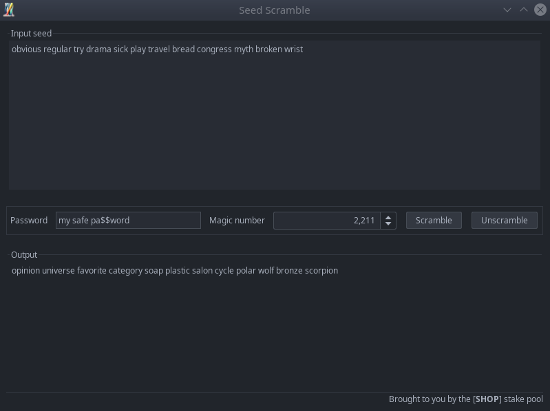

# Seed Scramble

A simple utility to scramble/unscramble cryptocurrency wallet seed phrases

> Brought to you by the **SHOP** stake pool

## Purpose

I created this tool for myself to give me peace of mind writing down seed 
phrases for my crypto currency wallets - and that includes hardware wallets.
 
Whenever you setup a hardware wallet or use a software-based wallet to store
cryptocurrency, you will be presented with a list of words that give access to 
your funds in the blockchain.

Writing down this list of words means that if anyone finds these words, they'll
be able to restore your wallet and steal your funds.  

Give this application your seed phrase with a password and a magic number. It
will create a "fake" seed phrase which you can note down. 

If you want to restore your original seed phrase, give this application the
"fake" seed phrase, the password and the magic number.

It's dead simple to use, and no one will ever be able to figure out the actual
seed phrase of your wallets.


### Example

The app is a single screen that looks like this:



In the example above, we assume your wallet gave the following seed phrase:
```
obvious regular try drama sick play travel bread congress myth broken wrist
```

You can input a password & a magic number to generate a fake seed phrase:

```
opinion universe favorite category soap plastic salon cycle polar wolf bronze scorpion
```

You can note that down in a piece of paper instead of the original seed phrase, then
recover the original by unscrambling the fake seed with the password and magic
number you used. 

If anyone finds the fake seed phrase they won't be able to steal your funds.

## INSTALLATION

Simply download the [latest release](https://github.com/uniVocity/SeedScramble/releases/download/1.0.0/SeedScramble.zip)
from [the releases page](https://github.com/uniVocity/SeedScramble/releases/tag/1.0.0)
and move it to an old computer with NO INTERNET CONNECTION. You want to do this offline.

Unzip the `SeedScramble.zip` file and double-click the `run` command to launch it:

 * `run.bat` on Windows
 * `run.command` on MacOS
 * `run.sh` on Linux
  
Ideally, nuke the computer once you ran this software. 

